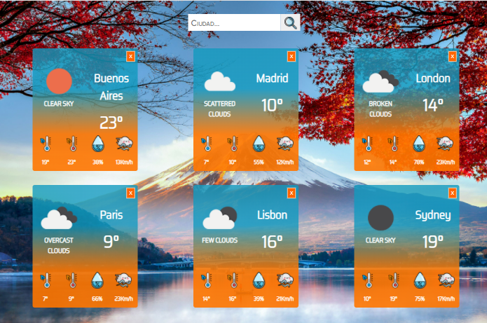

# React Weather-App

 

 Aplicación realizada en react, la cual consiste en introducir el nombre de la ciudad que se desea consultar para la obtención del clima.

 

Esta aplicación se desarrollo como parte del ciclo de formación, en la misma se consumió una api externa para extraer los datos en tiempo real del clima de cada ciudad consultada.

Sitio deployado en "[https://the-weather-api-react.netlify.app/]"

  

